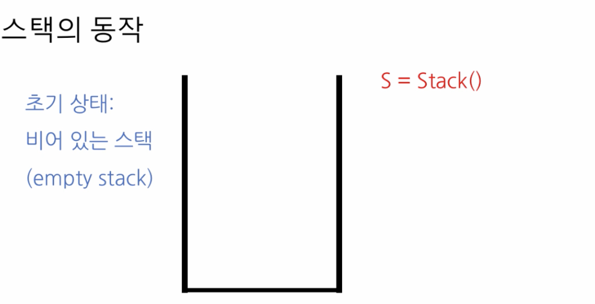

# 1. 스택\(Stack\)의 개념

## 스택\(Stack\)

* 자료\(data element\)를 보관할 수 있는 \(선형\) 구
* 선형이라는 것은 데이 자료들이 일렬로 늘어서는 것을 의미
* 단, 넣을 때에는 한 쪽 끝에서 밀어넣어야 하
  * 푸시\(push\) 연
*  꺼낼 때에는 같은 쪽에서 뽑아 꺼내야 하는 제약이 있
  * 팝\(pop\) 연
* 후입선출\(LIFO: Last In First Out\) 특징을 가지는 선형 자료구

