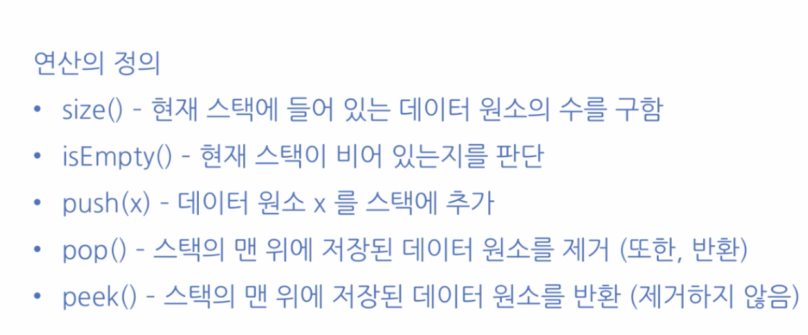
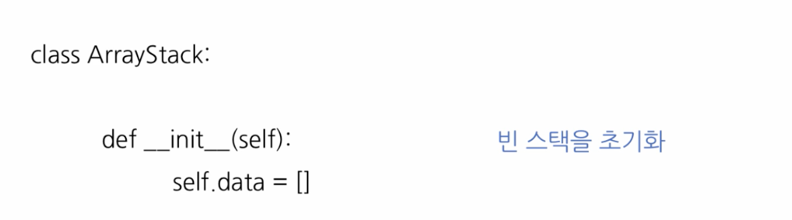
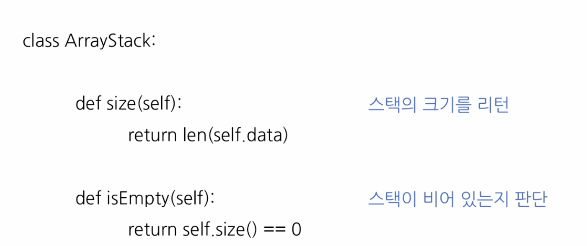
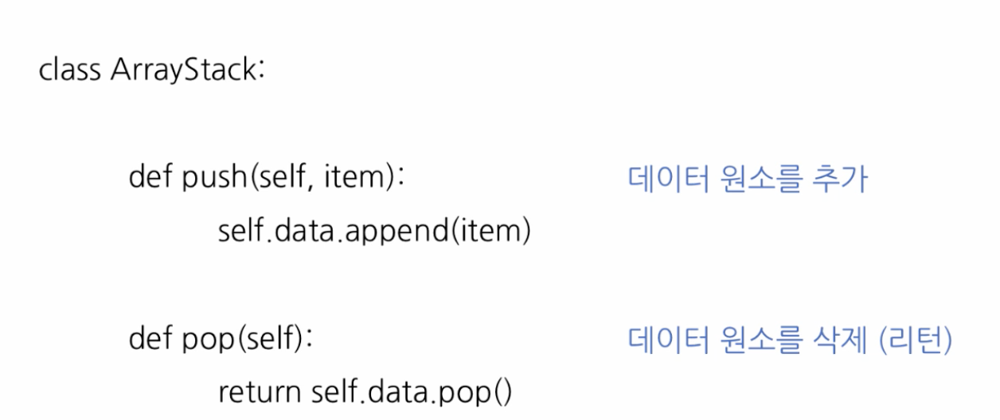
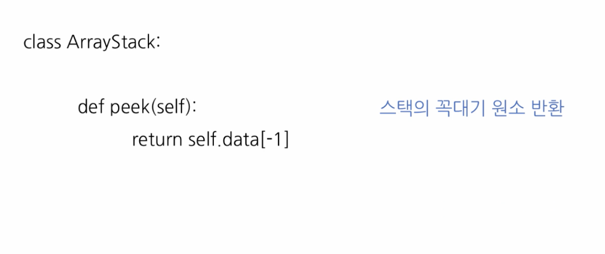

# 2. 스택의 추상적 자료구조 구현

## 스택의 추상적 자료구조 구

* 1. 배열\(Array\)을 이용하여 구현
     1. Python 리스트와 메서드들을 이용
  2. 연결리스트\(Linked List\)를 이용하여 구현
     1. 양방향 연결리스트 이



## 배열로 구현한 스택









```python
from doublylinkedlist import Node
from doublylinkedlist import DoublyLinkedList

class LinkedListStack:

	def __init__(self):
		self.data = DoublyLinkedList()

	def size(self):
		return self.data.getLength()

	def isEmpty(self):
		return self.size() == 0

	def push(self, item):
		node = Node(item) 		# 새로운 노드 node 를 만
		self.data.insertAt(self.size() + 1, node)

	def pop(self):
		return self.data.popAt(self.size())

	def peek(self):
		return self.data.getAt(self.size()).data
```

