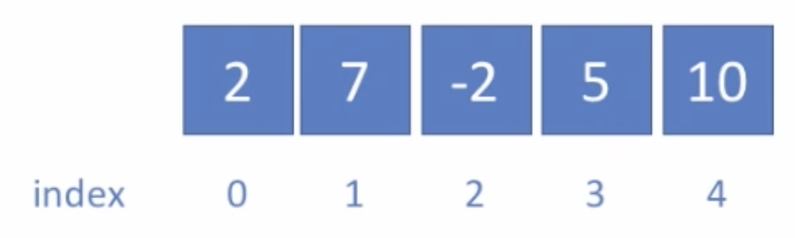
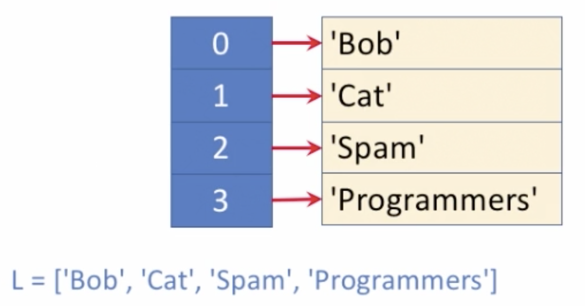
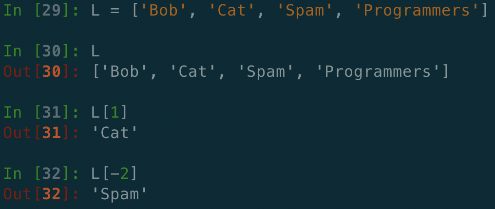

# 1. 선형 배열\(Linear Arrays\)

## 선형 배열\(Linear Arrays\)

* 파이썬에서는 Array 를 List 로 표현
  * Array는 동일한 타입만 열거할 수 있는 반면, 파이썬에서의 List 에서는 어떠한 데이터 타입도 열거할 수 있

## 배열

* 원소들을 순서대로 늘어놓은 

* Python 에서의 리스트\(list\)

## 리스트\(배열\) 연산

* 1. 원소 덧붙이기
  2. 끝에서 꺼내

