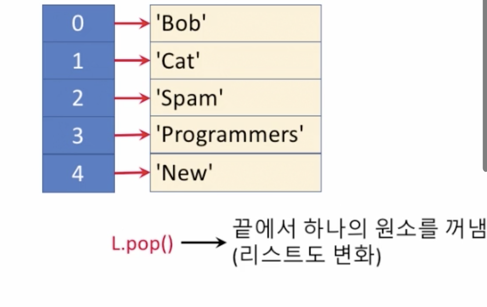
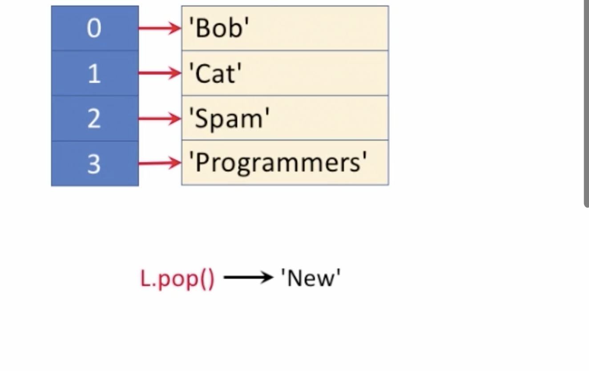
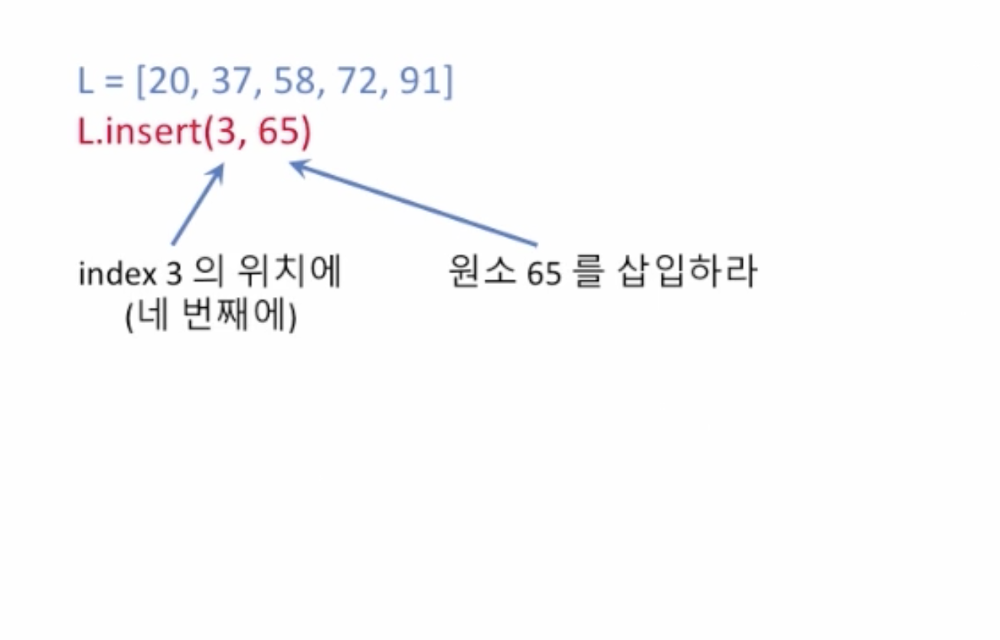
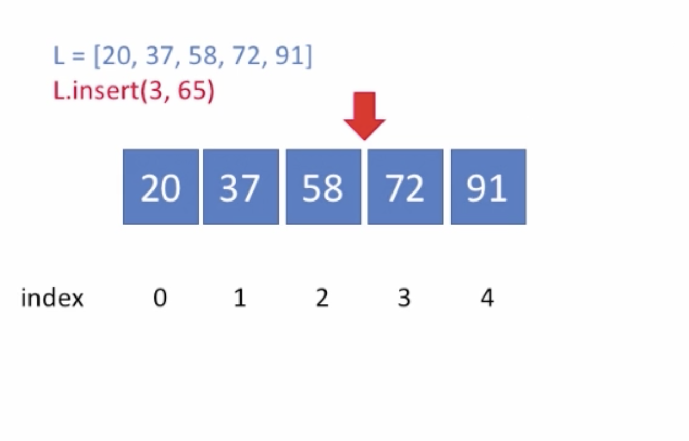
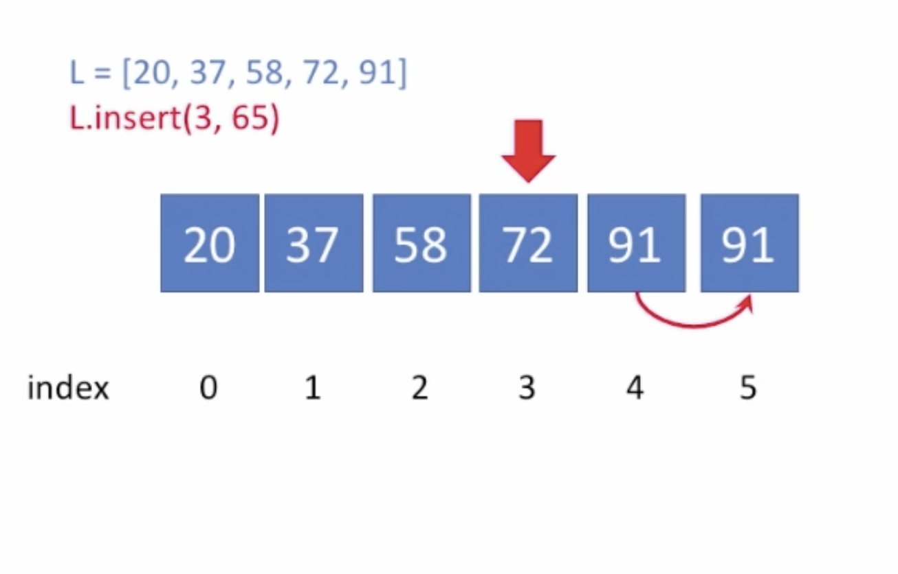
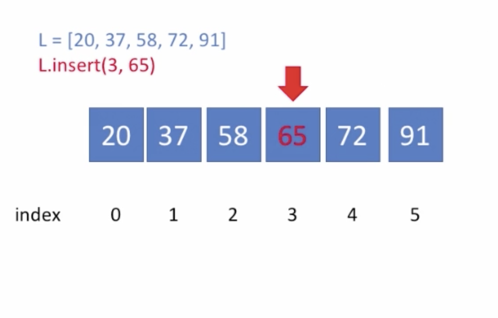
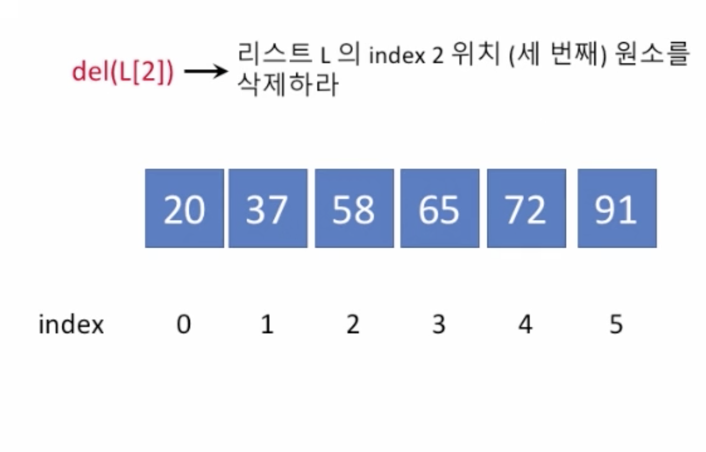
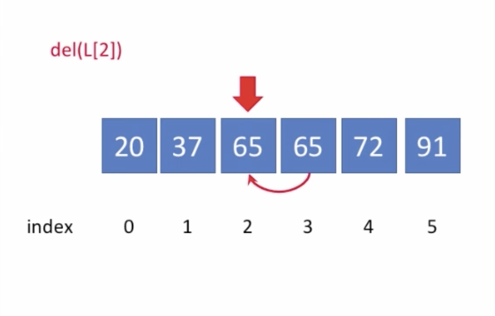
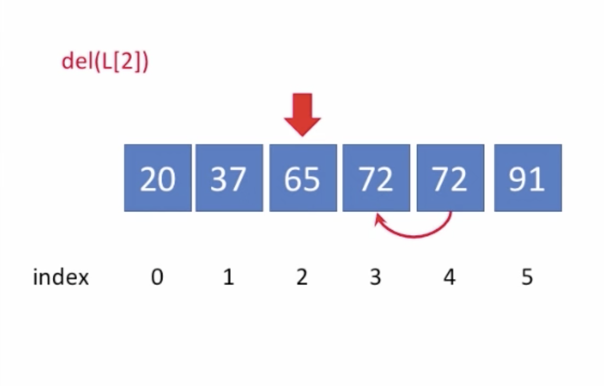

# 1. 선형 배열\(Linear Arrays\)

## 선형 배열\(Linear Arrays\)

* 파이썬에서는 Array 를 List 로 표현
  * Array는 동일한 타입만 열거할 수 있는 반면, 파이썬에서의 List 에서는 어떠한 데이터 타입도 열거할 수 있

## 배열

* 원소들을 순서대로 늘어놓은 

* Python 에서의 리스트\(list\)

## 리스트\(배열\) 연산

* 1. 원소 덧붙이기
  2. 끝에서 꺼내
* 순식간에\(빠르게\) 할 수 있는 일
  * 리스트의 길이와 무관\(상수 시간\)
  * O\(1\)

## 원소 덧붙이

## 원소 끝에서 꺼내

## 리스트\(배열\) 연산

* 1. 원소 삽입하기
  2. 원소 삭제하
* 리스트의 길이가 길면 오래 걸리는 일
  * 리스트의 길이에 비례\(선형 시간\)
  * O\(n\)
  * 예를 들어 아주 긴 리스트가 있는데 제일 앞에 삽입하려고 하면 그 뒤에 있는 모든 원소들을 전부 뒤로 보내야 한
  *  마찬가지로 아주 긴 리스트가 있는데 제일 앞의 원소를 삭제하려고 하면 앞으로 한칸 씩 다 옮기고 제일 마지막에 있는 인덱스를 없애야 한다.

## 원소 삽입하

## 원소 삭제하

## 여기서 del\(L\[2\]\) 와 L.pop\(2\) 의 차이점은 무엇일까?

* 삭제한다는 점에서는 비슷해보이나
  * pop\( \)은 지워진 인덱스의 값을 반환하지만
  * del 은 지워진 인덱스의 값을 반환하지 않는
* 이 차이 때문에 del 이 pop\( \) 보다 수행 속도가 미세하게 빠르다 

## 리스트\(배열\) 연산

* 1. 원소 탐색하

## 연습 문제 1

* 정렬된 리스트에 주어진 원소 삽입하기
* 힌트:
  * 1. 주어진 원소를 삽입할 위치를 찾는다
    2. 해당 위치에 원소를 삽입한다

       1. 그 결과는 여전히 정렬된 상태를 유지하는 리스

## 연습 문제 2

* 주어진 리스트에서 특정 원소를\(여러 번 들어 있을 수 있음\) 모두 찾아내라
* 힌트:
  * 1. index\( \) 메서드를 이용한다
    2. 리스트 슬라이싱을 이용해서 반복하여 찾는

## Summary

### 리스트 길이와 관계 없이 빠르게 실행 결과를 보게되는 연산들

* 원소 덧붙이기 `.append()`
* 원소 하나를 꺼내기 `.pop()`

위 연산들은 리스트의 길이와 무관하게 빠르게 실행할 수 있는 연산들입니다. 리스트의 길이가 아무리 길어도 맨 끝에 요소 하나를 추가하는 것이나 맨 끝 요소 하나를 빼는건 빠르게 할 수 있는 일이죠. 반면, 리스트가 커지면 그에 따라 실행시간이 길어지는 연산들도 있습니다.

### 리스트의 길이에 비례해서 실행 시간이 걸리는 연산들

* 원소 삽입하기 `.insert()`
* 원소 삭제하기 `.del()`

이런 연산들은 리스트의 길이가 길면 길수록 처리가 오래 걸리게 됩니다. 구체적으로 말하면 리스트의 길이예 실행 시간이 비례합니다. 리스트 길이가 100 배가 되면, 위 연산들을 실행하는 데 걸리는 시간도 100 배 커집니다.

### 추가 다른 연산

* 원소 탐색하기: `.index()`

