# 3. 리스트에서 원소 삽입하기, 삭제하기

## 리스트\(배열\) 연산

* 1. 원소 삽입하기
  2. 원소 삭제하
* 리스트의 길이가 길면 오래 걸리는 일
  * 리스트의 길이에 비례\(선형 시간\)
  * O\(n\)
  * 예를 들어 아주 긴 리스트가 있는데 제일 앞에 삽입하려고 하면 그 뒤에 있는 모든 원소들을 전부 뒤로 보내야 한
  *  마찬가지로 아주 긴 리스트가 있는데 제일 앞의 원소를 삭제하려고 하면 앞으로 한칸 씩 다 옮기고 제일 마지막에 있는 인덱스를 없애야 한다.

## 원소 삽입하

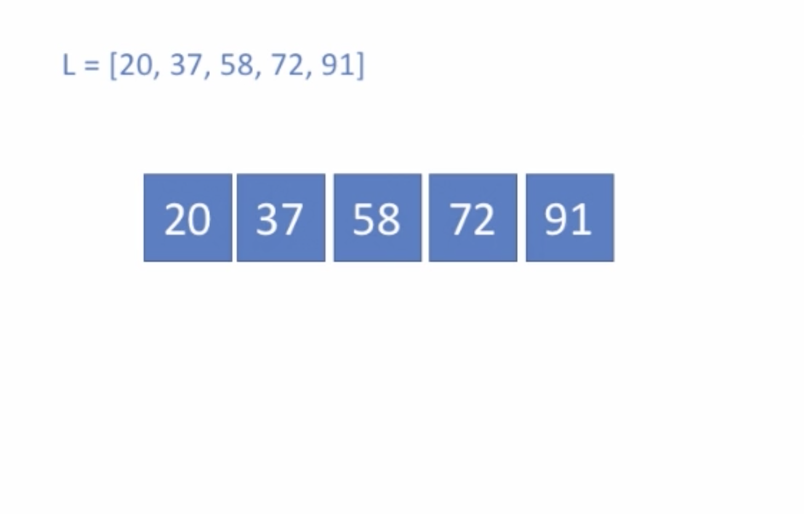

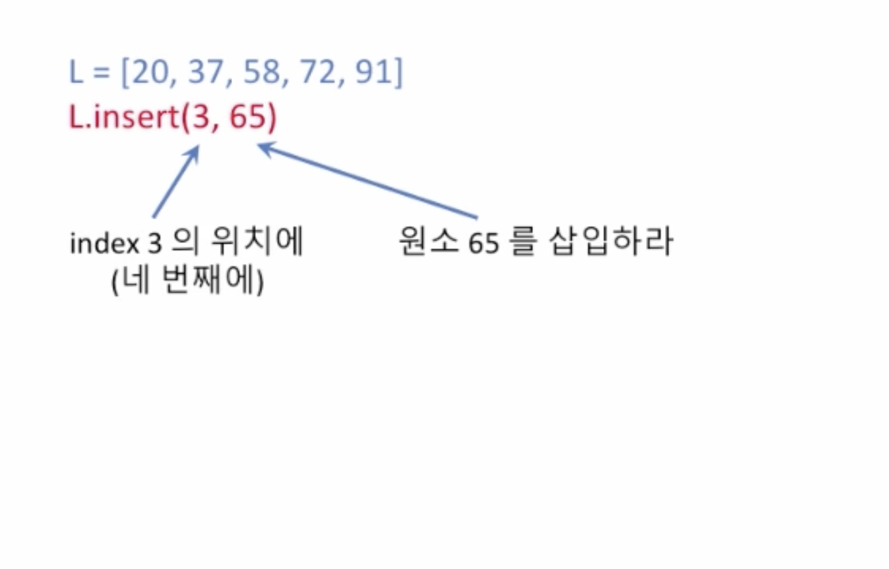

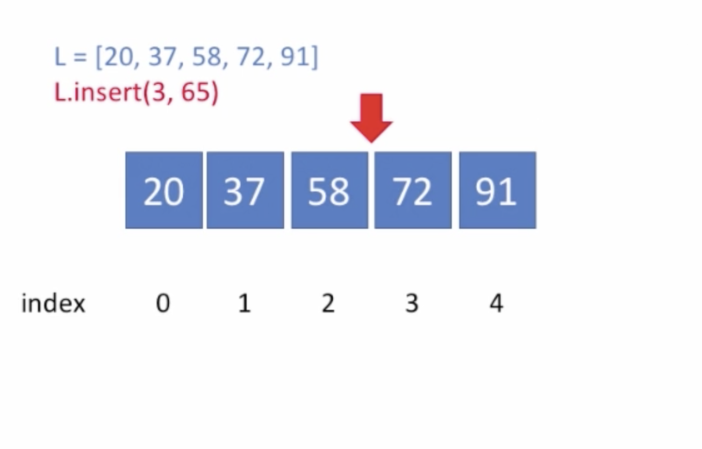

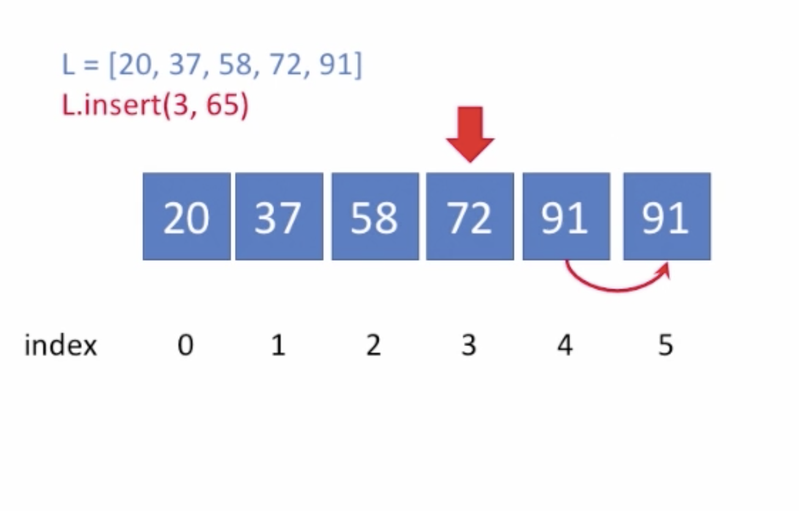

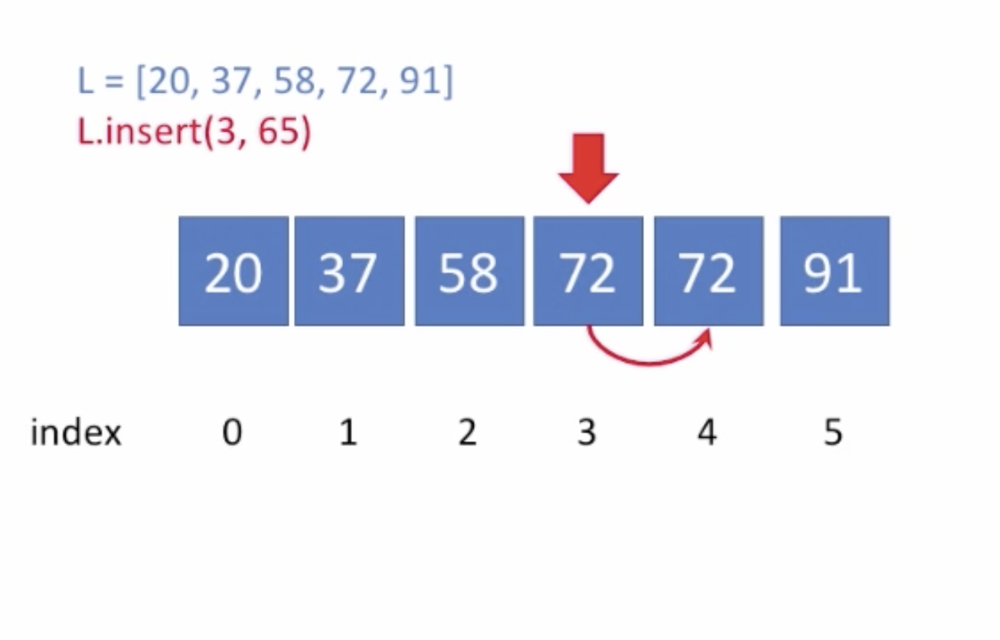

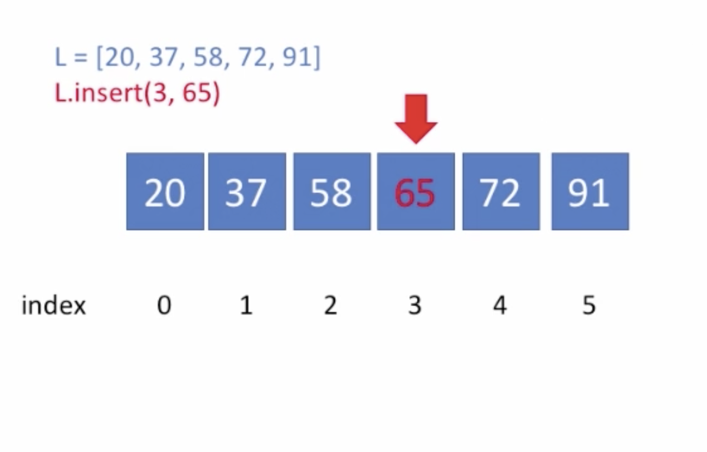

## 원소 삭제하

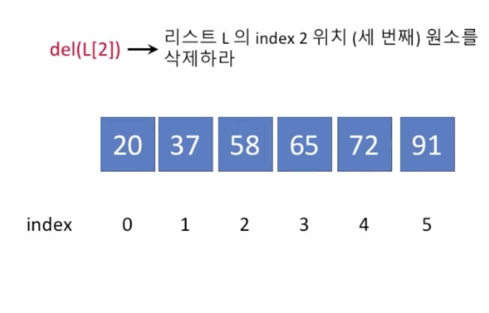

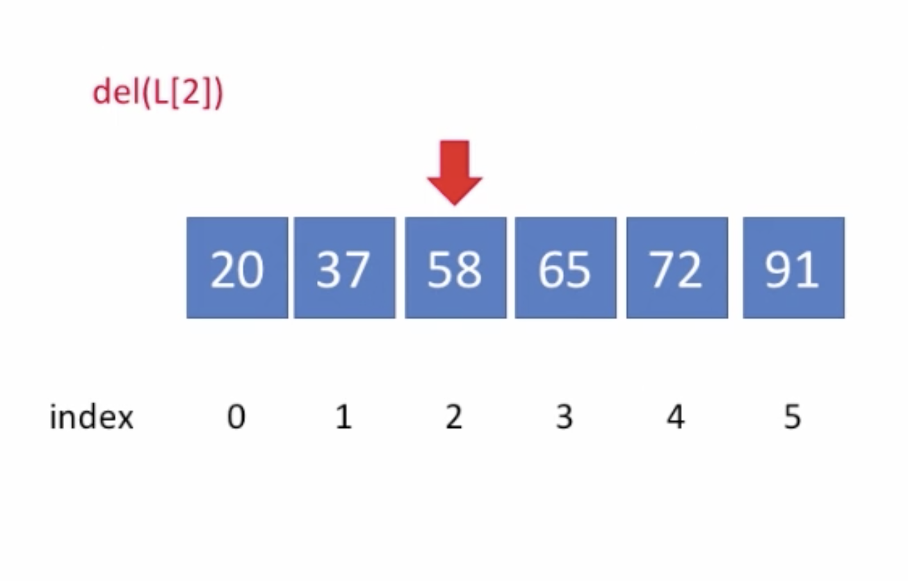

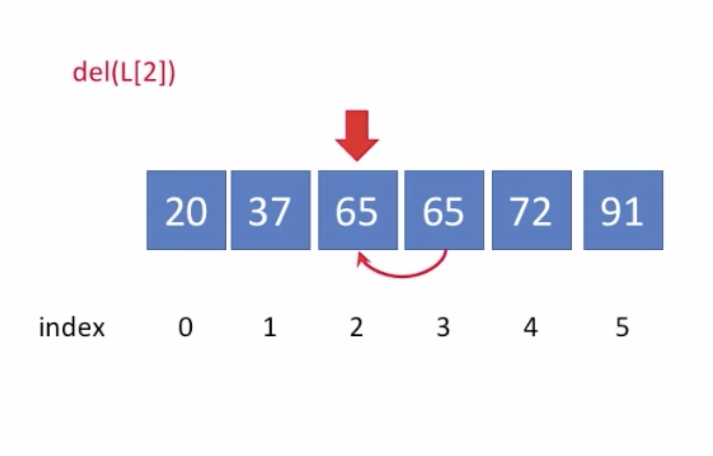

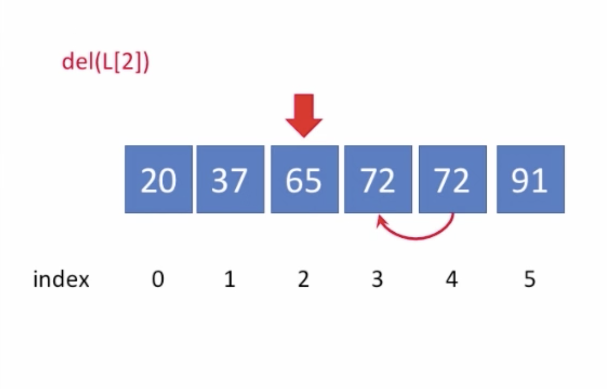

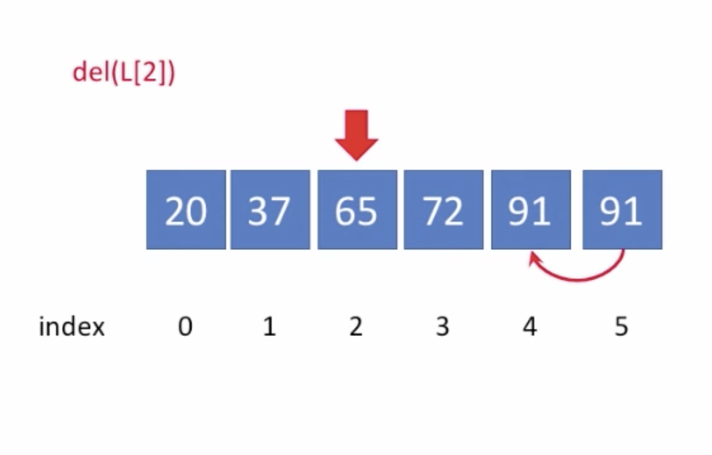

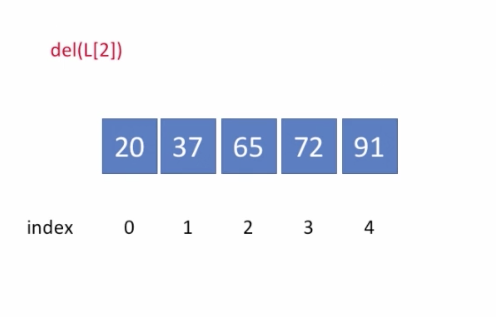

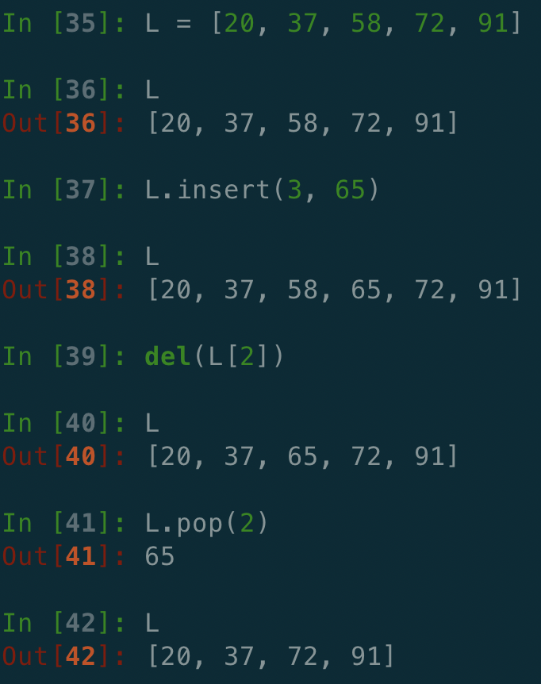

## 여기서 del\(L\[2\]\) 와 L.pop\(2\) 의 차이점은 무엇일까?

* 삭제한다는 점에서는 비슷해보이나
  * pop\( \)은 지워진 인덱스의 값을 반환하지만
  * del 은 지워진 인덱스의 값을 반환하지 않는
* 이 차이 때문에 del 이 pop\( \) 보다 수행 속도가 미세하게 빠르다 

