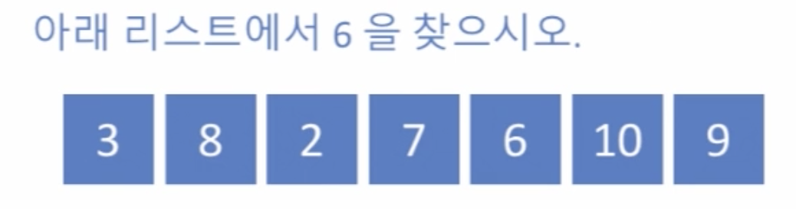
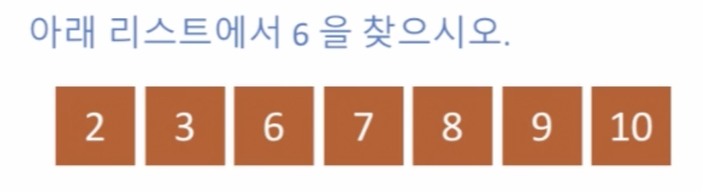
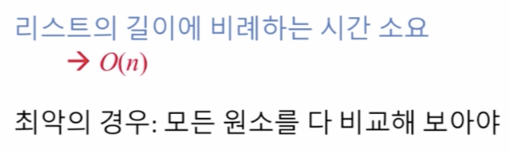
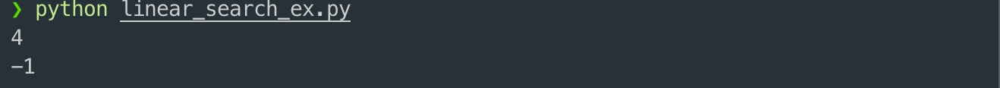

# 2. 선형 탐색\(Linear Search\)

## 선형 탐색\(Linear Search\)



* 정렬되어 있지 않은 경우 리스트에서 6을 찾을 때,
* 1. 3을 6과 비교하고
  2. 8을 6과 비교하고
  3. 2를 6과 비교하고
  4. 7을 6과 비교하고
  5. 6과 6을 비교하면 마침내 찾음



* 정렬되어 있는 경우 리스트에서 6을 찾을 때,
* 1. 2를 6과 비교하고
  2. 3을 6과 비교하고
  3. 6과 6을 비교하면 마침내 찾음

### 즉, 앞에서 부터 찾을 때, 정렬 안된 경우와 정렬된 경우 모두 같은 시간이 걸린다.



```python
def linear_search(L, x):
    i = 0
    while i < len(L) and L[i] != x:
        i += 1
    # x 값에 해당하는 인덱스 i 를 찾았다면,
    if i < len(L):
        return i
    else:
        return -1

L = [3, 8, 2, 7, 6, 10, 9]
print(linear_search(L, 6))
print(linear_search(L, 1))
```




