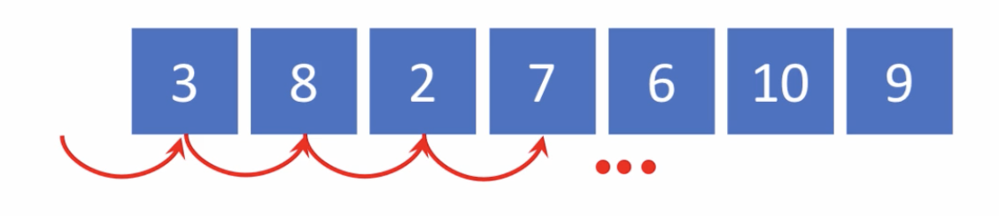
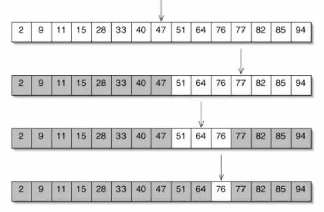

# 3. 탐색 알고리즘

## 탐색: 선형 시간 알고리즘 - O\(N\)

* 예: n개의 무작위로 나열된 수에서 최댓값을 찾기 위해 선형 탐색 알고리즘을 적용

* 최댓값: 끝까지 다 살펴 보기 전까지는 알 수 없
*  Average case: O\(N\)
* Worse-case: O\(N\)

## 탐색: 로그 시간 알고리즘 - O\(logN\)

* 예: n개의 **크기 순으로 정렬된** 수에서 특정 값을 찾기 위해 이진 탐색 알고리즘을 적용

