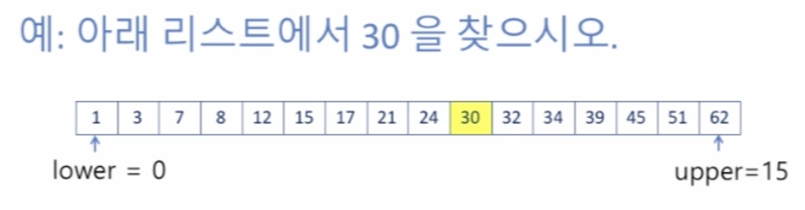

# 3. 이진 탐색\(Binary Search\)

## 이진 탐색\(Binary Search\)

* 탐색하려는 리스트가 **이미 정렬되어 있는 경우에만** 적용 가능
* 크기 순으로 정렬 되어 있다는 성질 이

* 처음, \(lower + upper\) / 2 를 사용하여 중간 인덱스를 찾는

* middle index 인 7의 값 21은 30 보다 작다. 이 경우 middle 값을 포함한 왼쪽에 있는 모든 값들을 탐색에서 제외한다. 
  * 왜냐하면 리스트가 정렬되어 있는 경우 21 이 30 보다 작으므로 21을 포함한 왼쪽에 있는 값들은 모두 30 보다 작을 것이기 때문이다.

* 이제 제외된 인덱스보다 1 칸 오른쪽에 있는 값을 lower 로 지정한

* 같은 과정, 즉 \(lower + upper\) / 2 를 반복하면 이제 중간 인덱스는 11이 된

* 30 과 middle index 11 의 값을 비교하는데, middle index 11 의 값 34가 우리가 찾고자 하는 값 30 보다 크므로, middle index 를 포함한 오른쪽에 있는 값들을 탐색에서 제외한

* 새로운 upper 를 오른쪽에서 삭제된 인덱스 바로 앞으로 지정한

* 이제 middle 은 \(lower + upper\) / 2 = \(8 / 10\) / 2 = 9 가 되는 데 9에 있는 값은 30이므로 우리가 찾고자 하는 것을 발견하게 된다.

## 이진 탐색 코드의 구

