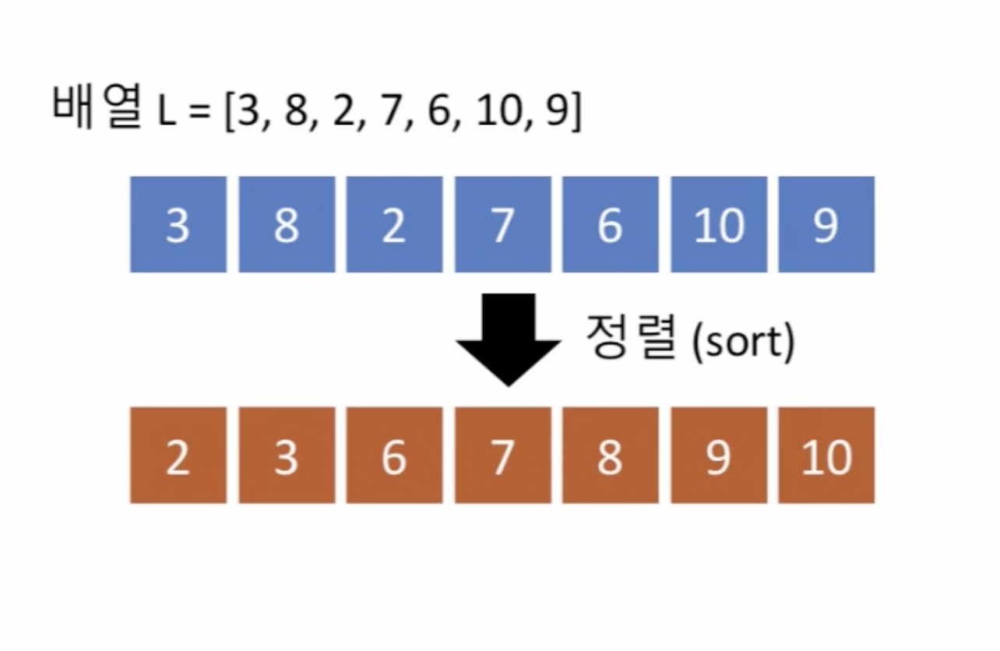
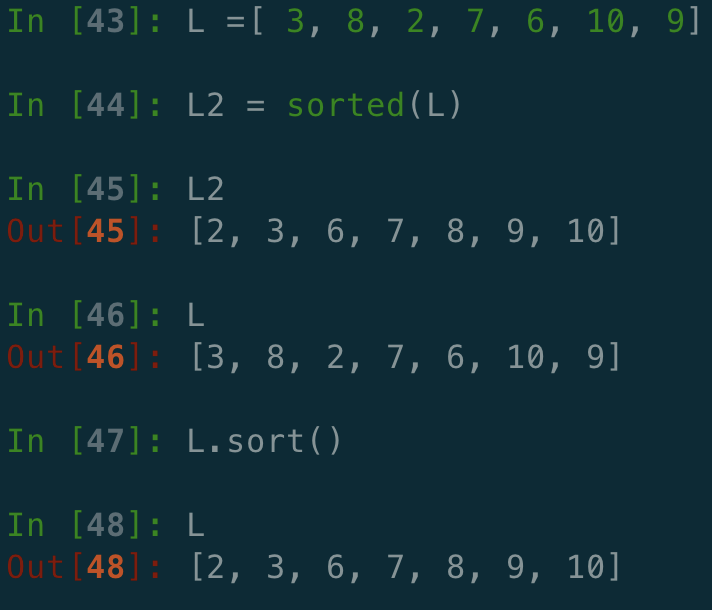
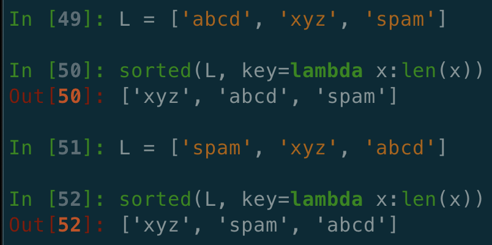

# 1. 배열: 정렬과 탐색\(Sorting & Searching\)

## Sorting & Searching

## Python 리스트의 정렬

* sorted\( \)
  * 내장 함수\(bulit-in function\)
  * 정렬된 새로운 리스트를 얻어냄
* sort\( \)
  * 리스트의 메서드\(method\)
  * 해당 리스트를 정렬

## 정렬의 순서를 반대로

* reverse = True 인자를 추가하면 됨
  * L2 = sorted\(L, reverse = True\)
  * L.sort\(reverse=True\)

## 정렬: 문자열로 이루어진 리스트의 경우

* 정렬 순서는 사전 순서\(알파벳 순서\)를 따름
  * 문자열 길이가 긴 것이 더 큰 것이 아님
* 문자열 길이 순서로 정렬하고 싶으면?
  * 정렬에 이용하는 키\(Key\) 지정

## 정렬: 키를 지정하는 또 다른 예

* L = \[{'name′: 'John′,  'score′:83}, {'name′: 'Paul′, 'score′: 92}\]
  * L.sort\(key=lambda x:x\['name′\]\)
    * 레코드들을 이름 순서대로 정렬
  * L.sort\(key=lambda x:x\['score'\], reverse = True\)
    * 레코드들을 점수 높은 순으로 정

