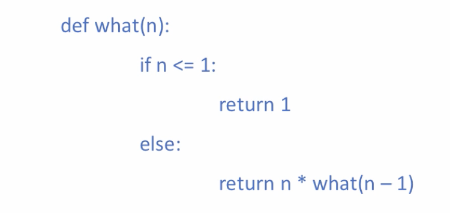
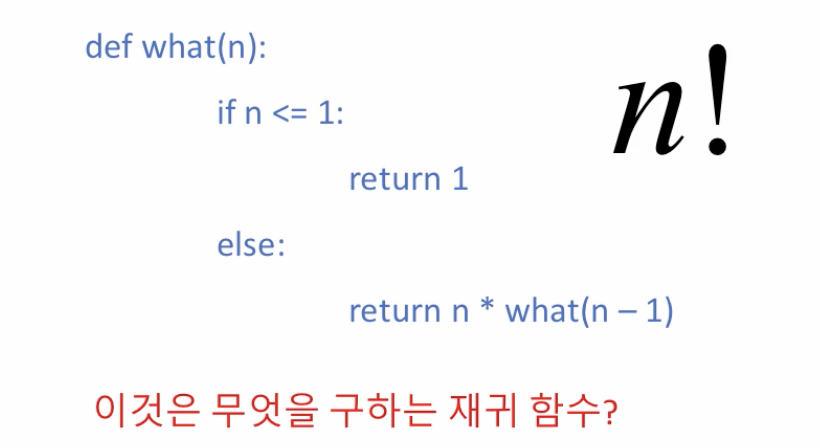
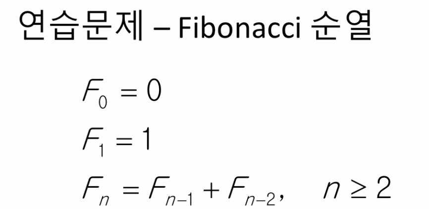
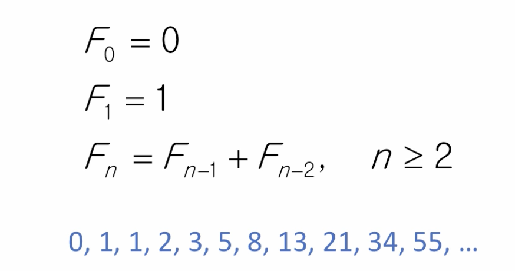
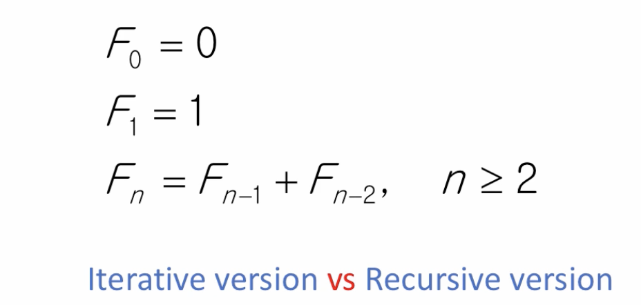

# 4. 재귀 알고리즘 추가 예제

## 재귀 알고리즘 추가 예











```python
# Using Recursion

def fibo(n):
    if n == 0:
        answer = 0
    elif n == 1:
        answer = 1
    else:
        answer = solution(n - 1) + solution(n - 2)
    return answer

print(solution(10))
```

```python
# Using Iterative
# 이해안

def solution2(n):
    a = 0
    b = 1

    for _ in range(0, n):
        # Disply the current Fibonacci number
        print(a)
        temp = a
        a = b
        b = temp + b
    return a

print(solution2(10))
```

