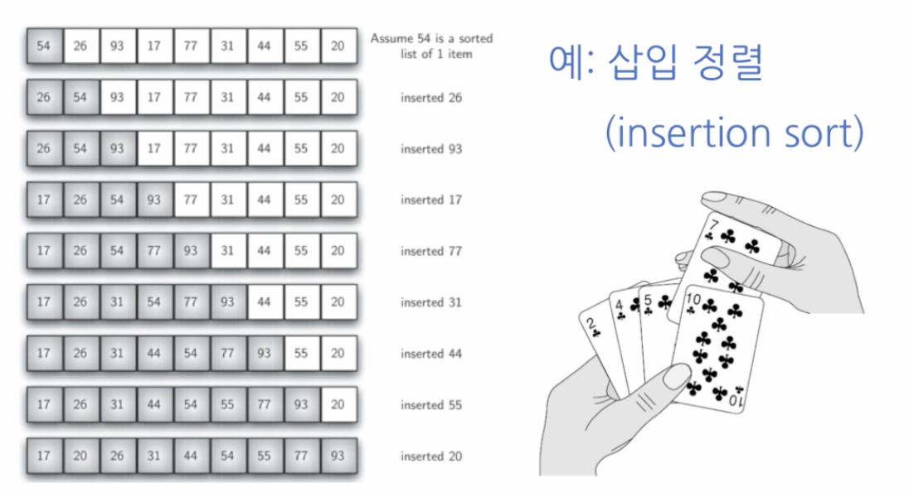
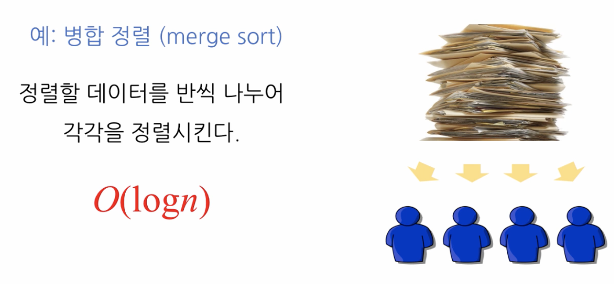
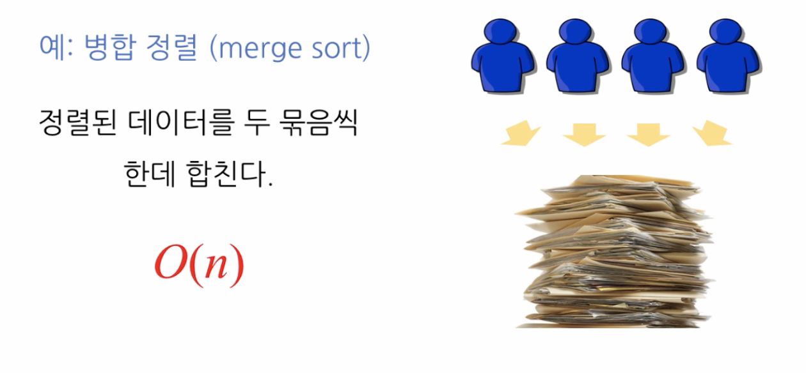
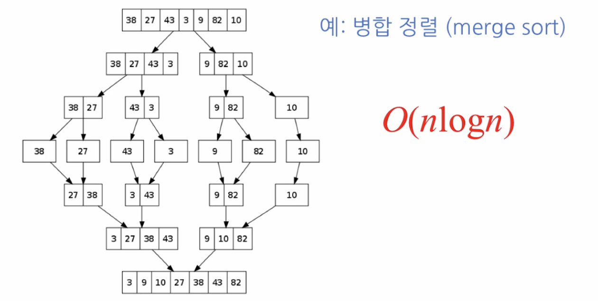
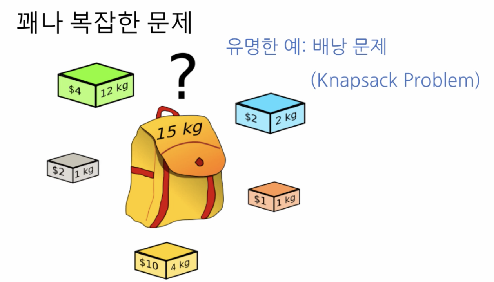

# 4. 정렬 알고리즘

## 정렬: 이차 시간 알고리즘 - O\(N²\)

* 하나의 원소를 넣을 때 삽입할 위치를 정해야 하고 그리고 그 동작을 원소의 갯수 n 만큼 반복하기 때문에 n \* n 즉 O\(n²\) 를 갖는 알고리즘이다
* Best Case: O\(N\)
  * 처음 주어진 배열이 이미 다 정렬되어 있는 상태였다면 그냥 확인만하고, 즉 아무것도 삽입하지 않고, n 개의 수를 살펴보기만 하고 끝나기 때문에 O\(N\) 이
* Worst Case: O\(N²\)
  * 만약 배열의 수가 역순으로 이루어져있다면 뒤로 한 칸씩 전부 미뤄야 하기 때문에 O\(N²/2\) = O\(N²\)

## 보다 나은\(낮은\) 복잡도를 가지는 정렬 알고리즘

* 예: 병합 정렬\(Merge Sort\): O\(NlogN\)
  * 참고: 입력 패턴에 따라 정렬 속도에 차이가 있지만, 정렬 문제에 대해 **O\(NlogN\)** 보다 낮은 복잡도를 가지는 알고리즘은 존재할 수 없음이 증명되어 있음

* Divide and Conquer 이용: 시험지를 전부 걷어서 학생들에게 나눠주는 것
* 만약 100명의 학생의 시험지를 걷어서 한 명 한 명에게 전부 다 나눠주면 시간이 엄청 오래 걸린다. 대신에, 한 10명 정도를 불러서 각자에게 시험지 10개 정도 정렬해오라고 하고, 다시 그 각각의 10 명은 5명에게, 그 5명은 2명에게, 이런 식으로 1명이 될 때까지 다 정렬한다음 \(왜냐하면 1개는 이미 정렬되어 있으므로\) 위로 합치는 과정이 바로 Divide and Conquer 이



## Knapsack Problem

* O\(2ⁿ\)
* Dynamic Programming 을 이용하여 풀 순 있으나, 다른 알고리즘 보다 훨씬 복잡하

