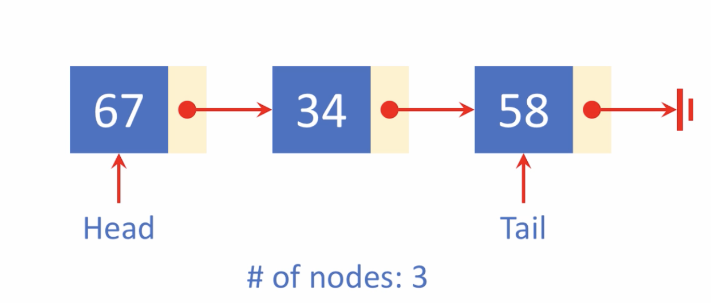
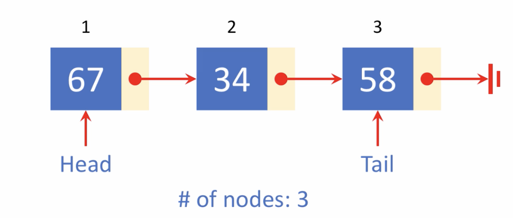
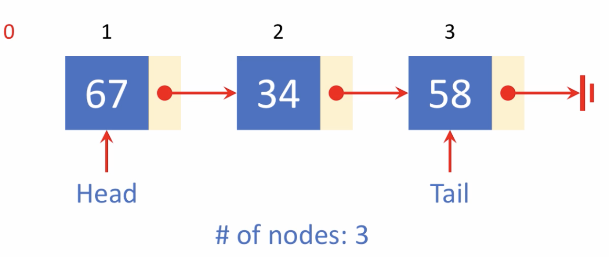
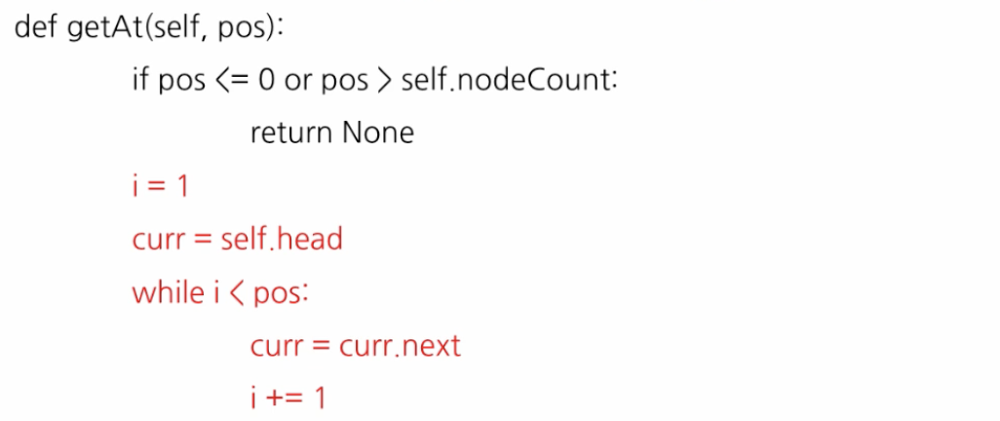
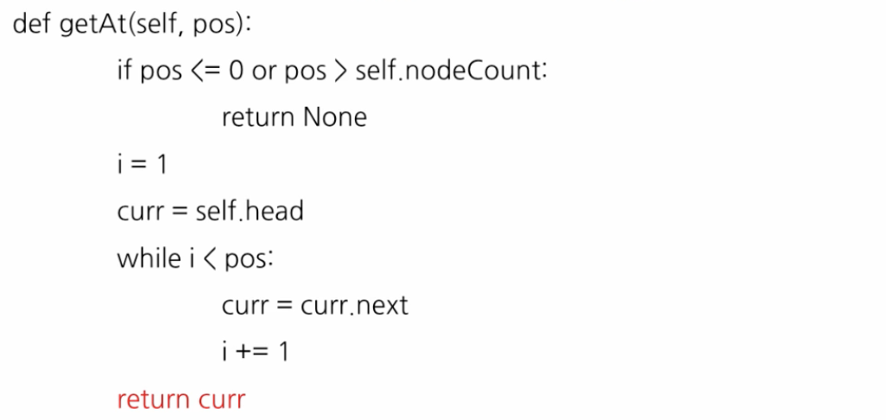
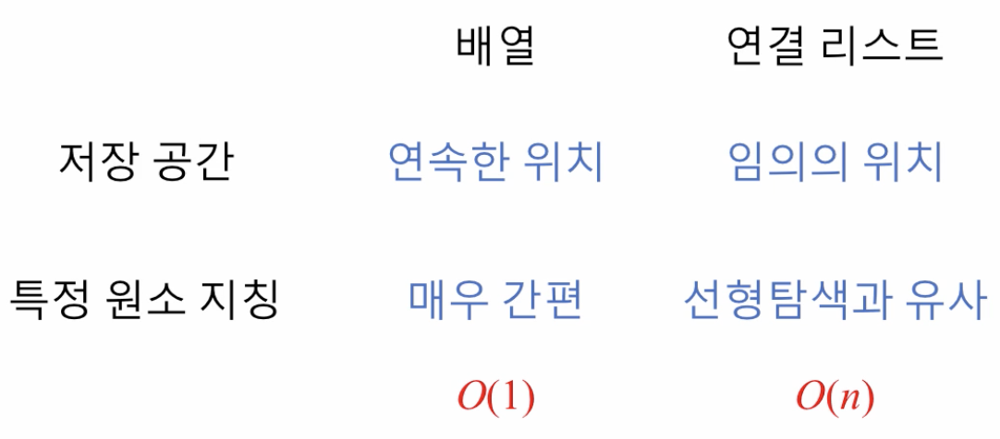

# 4. 특정 원소 참조\(k 번째\)

## 연산 정의

1. 특정 원소 참조 \(k 번째\)
2. 리스트 순회
3. 길이 얻어내
4.  원소 삽입
5. 원소 삭제
6. 두 리스트 합치기

## 특정 원소 참조 \(k 번째\)

* 0 으로 시작하는 인덱스가 아닌 1로 시작하는 인덱스로 정함

* 0을 다른 목적으로 이용

## 배열 vs. 연결리스트

