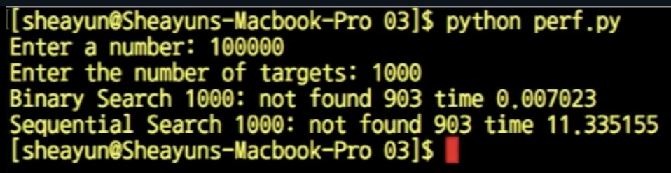

# 4. 선형 탐색과 이진 탐색의 성능 비교

## 선형 탐색 v.s. 이진 탐

* 선형 탐색과 이진 탐색은 성능 면에서 많은 차이가 난다. 그렇다면 이진 탐색은 항상 선형 탐색보다 좋은 것일까?
  * 이진 탐색은 선형 탐색과는 달리 **'**정렬되어 있어야만'′ 이라 하는 조건이 붙는다. 즉 리스트를 정렬하는 시간을 우리는 아직 언급하지 않았으므로 무조건 적으로 좋은 것은 아니

