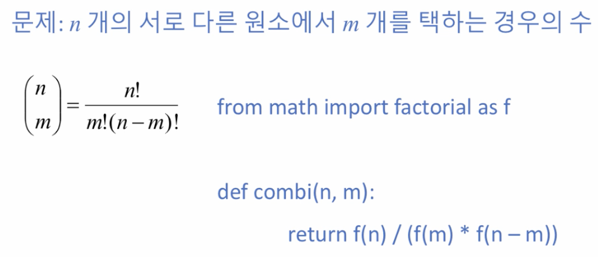
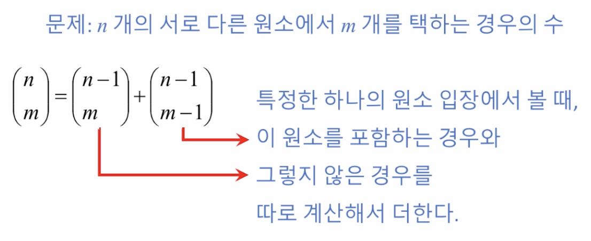
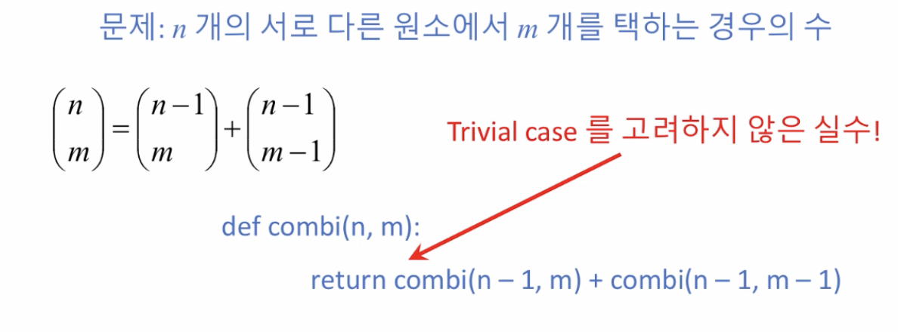
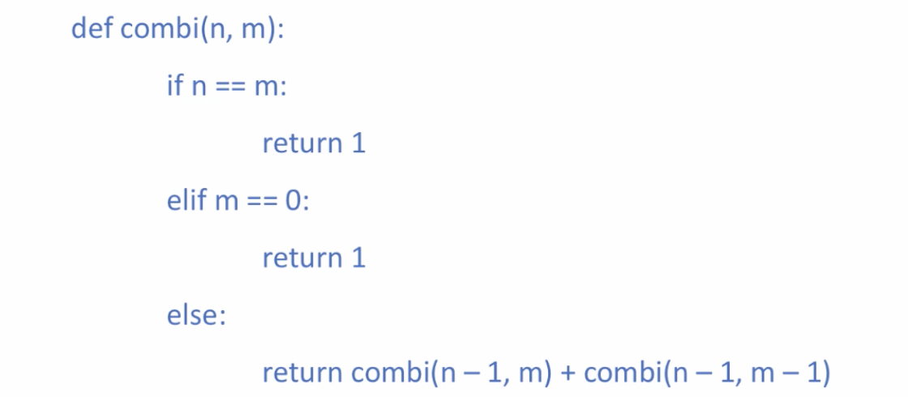
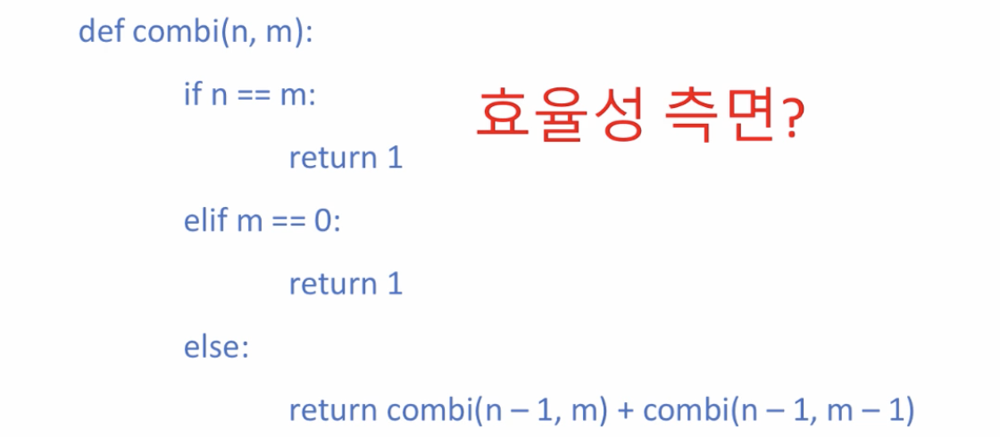

# 1. 조합의 수 계산

## 재귀함수\(Recursive Functions\)란?

* 하나의 함수에서 자신을 다시 호출하여 작업을 수행하는 

## 조합의 수 계산

## 조합의 수 계산 - 재귀적 방법으로

* 그렇다면 효율성 측면에서 좋은 것인가? n 이 커지면 여러번 함수를 호출해야한다 -&gt; 비효율적
* 그렇다면 왜 재귀함수를 사용하는 것인가?

