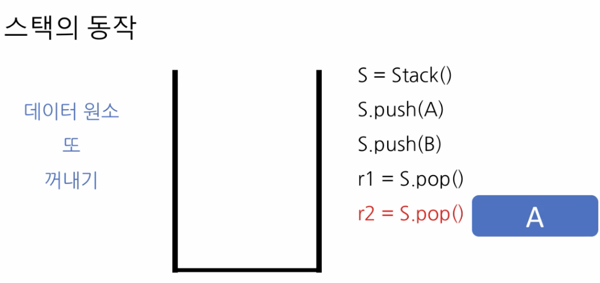

# 2. 재귀 알고리즘의 유용성

## 하노이의 탑

* Tower of Hanoi is a mathematical puzzle where we have three rods and n disks. 
* The objective of the puzzle is to move the entire stack to another rod, obeying the following simple rules: 
  * 1. Only one disk can be moved at a time. 
    2. Each move consists of taking the upper disk from one of the stacks and placing it on top of another stack i.e. a disk can only be moved if it is the uppermost disk on a stack. 
    3. No disk may be placed on top of a smaller disk.



```python
def print_move(fr, to):
    print("Move from", str(fr), " to", str(to))
    
def hanoi_tower(n, fr, to, spare):
    if n == 1:
        print_move(fr, to)
    else:
        hanoi_tower(n - 1, fr, spare, to)
        hanoi_tower(1, fr, to, spare)
        hanoi_tower(n - 1, spare, to, fr)
```



