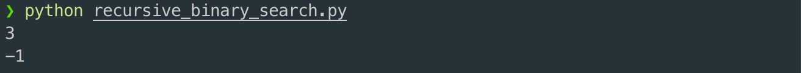

# 6. Implementaion

* 리스트 L 은 자연수 원소들로 이루어져 있으며, 크기 순으로 정렬되어 있다고 가정
* L = \[2, 3, 5, 6, 9, 11, 15\], x = 6, l = 0, u = 6 의 인자들이 주어지면,  L\[3\] == 6 이므로 3 을 리턴
* L = \[2, 5, 7, 9, 11\], x = 4, l = 0, u = 4 로 주어지면,  리스트 L 내에 4 의 원소가 존재하지 않으므로 -1 을 리턴

```python
def solution(L, x, l, u):
    if l > u:
        return -1
    mid = (l + u) // 2

    if x == L[mid]:
        return mid
    elif x < L[mid]:
        return solution(L, x, l, mid - 1)
    else:
        return solution(L, x, mid + 1, u)

L = [2, 3, 5, 6, 9, 11, 15]
x = 6
l = 0
u = 6
print(solution(L, x, l, u))

L = [2, 5, 7, 9, 11]
x = 4
l = 0
u = 4
print(solution(L, x, l, u))
```




