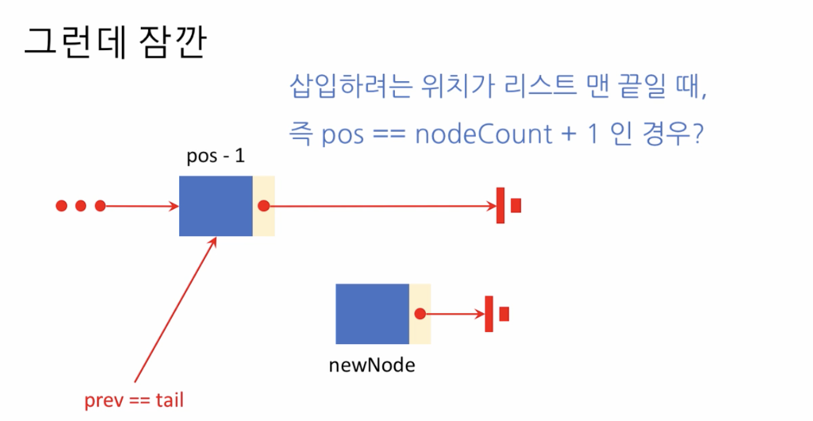
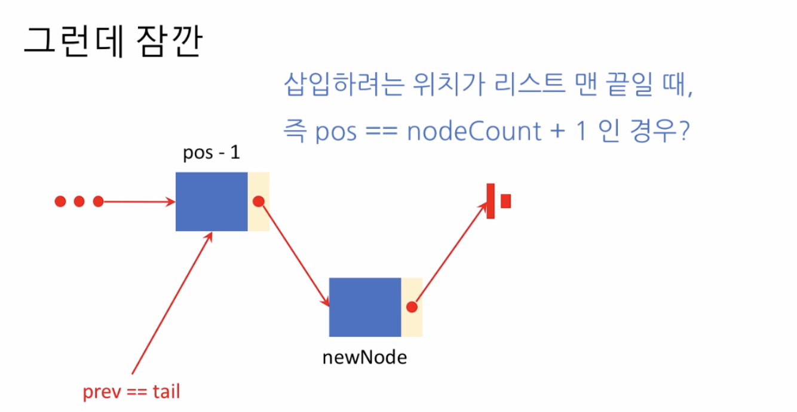

# 2. 원소 삽입 \(코드 구현\)

## 원소의 삽입 - 코드 구현

### 1. 삽입하려는 노드 이전의 위치를 구한다. prev 가 가리키도록.


### 2. 삽입하려는 노드의 next 를 prev.next 로 설정한다


### 3. 삽입하려는 노드의 이전을 prev.next 가 가리키도록 한다.


### 4. node 가 하나 추가되었으니 nodeCount 를 1 증가시킨다


## 주의사항


```python
def insertAt(self, pos, newNode):
    if pos < 1 or pos > self.nodeCount + 1:
        return False
    
    # (1) 삽입하려는 위치가 리스트 맨 앞일때
    if pos == 1:
        newNode.next = self.head
        self.head = newNode
    # 삽입하려는 위치가 처음이 아니라면
    else:
        # 1. 삽입하려는 노드 이전의 위치를 구한다.
        prev = self.getAt(pos - 1)
        # 2. 삽입하려는 노드의 next 를 prev.next를 가리키게
        newNode.next = prev.next
        # 3. 삽입하려는 노드의 이전을 prev.next 가 가리키게
        prev.next = newNode
    # (2) 삽입하려는 위치가 리스트 맨 끝일때
    if pos == self.nodeCount + 1:
        self.tail = newNode
    
    # 4. 노드가 하나 추가되었으니 nodeCount + 1
    delf.nodeCount += 1
    return True
```

## 삽입하려는 위치가 리스트 맨 끝일때 \(자세히\)




* 맨 앞에서 다 찾아갈 필요없이 prev.next 를 newNode 로 설정하면 된다.



```python
def insertAt(self, pos, newNode):
    if pos < 1 or pos > self.nodeCount + 1:
        return False
    
    # (1) 삽입하려는 위치가 리스트 맨 앞일때
    if pos == 1:
        newNode.next = self.head
        self.head = newNode
    # 삽입하려는 위치가 처음이 아니라면
    else:
        # 삽입하려는 위치가 제일 끝이면,
        if pos == self.nodeCount + 1:
            # 앞에서 부터 일일이 찾아가지않고 tail로 바로 설정
            prev = self.tail
        # 삽입하려는 위치가 제일 끝이 아니라면,
        else:
            # 1. 삽입하려는 노드의 이전 위치를 먼저 구한다
            prev = self.getAt(pos - 1)
        # 2. 삽입하려는 노드의 다음노드를 prev.next를 가리키게
        newNode.next = prev.next
        # 3. 삽입하려는 노드의 이전노드가 삽입하려는 노드를 가리키게
        prev.next = newNode
    # (2) 삽입하려는 위치가 리스트 맨 끝일때
    if pos == self.nodeCount + 1:
        self.tail = newNode
    
    # 4. 노드가 하나 추가되었으니 nodeCount + 1
    delf.nodeCount += 1
    return True
```

## 최종 Implementation

```python
class Node:
    def __init__(self, data):
        self.data = data
        self.next = None

class LinkedList:
    def __init__(self):
        self.nodeCount = 0
        self.head = None
        self.tail = None
    
    # 출력 메서드
    def __repr__(self):
        if self.nodeCount == 0:
            return 'LinkedList: empty'
        
        s = ''
        curr = self.head
        while curr is not None:
            s += repr(curr.data)
            if curr.next is not None:
                s += ' -> '
            curr = curr.next
        return s
    
    def getAt(self, pos):
        if pos <= 0 or pos > self.nodeCount:
            return None
        
        i = 1
        curr = self.head
        while i < pos:
            curr = curr.next
            i += 1
        return curr
    
    def insertAt(self, pos, newNode):
        if pos < 1 or pos > self.nodeCount + 1:
            return False
        
        # 삽입하려는 노드가 제일 앞일 때
        if pos == 1:
            newNode.next = self.head
            self.head = newNode
        # 삽입하려는 노드가 제일 앞이 아닐 때
        else:
            # 삽입하려는 노드가 제일 마지막 일때
            if pos == self.nodeCount + 1:
                prev = self.tail
            # 삽입하려는 노드가 제일 마지막이 아닐 때
            else:
                prev = self.getAt(pos - 1)
            newNode.next = prev.next
            prev.next = newNode
        
        if pos == self.nodeCount + 1:
            self.tail = newNode
        
        self.nodeCount += 1
        return True

a = Node(67)
b = Node(34)
c = Node(28)

L = LinkedList()
L.insertAt(1, a)
L.insertAt(2, b)
print(L)

L.insertAt(1, c)
print(L)
```

* 출력:
  * 67 -&gt; 34
  * 28 -&gt; 67 -&gt; 34


