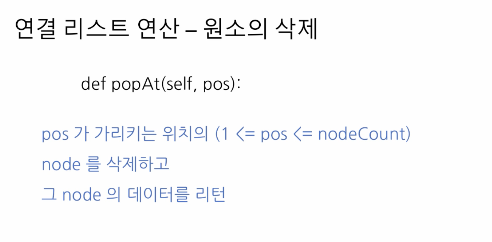
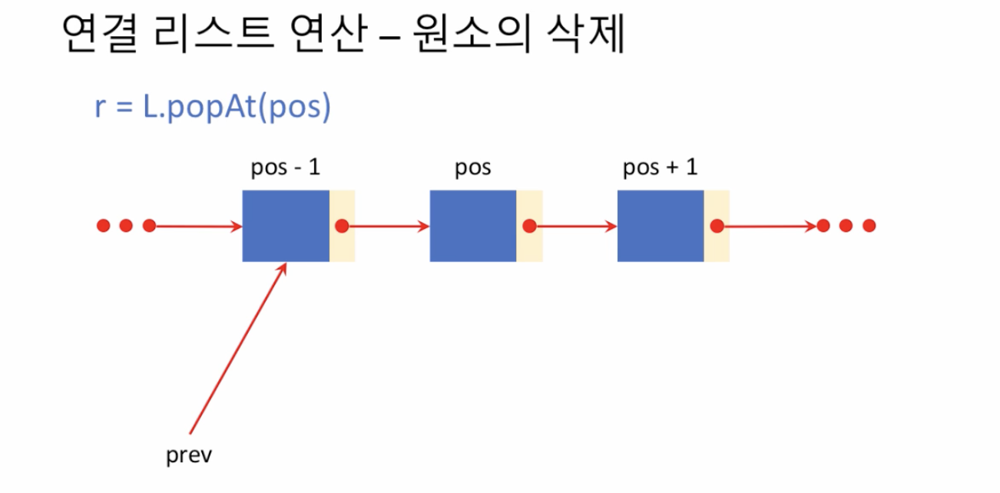
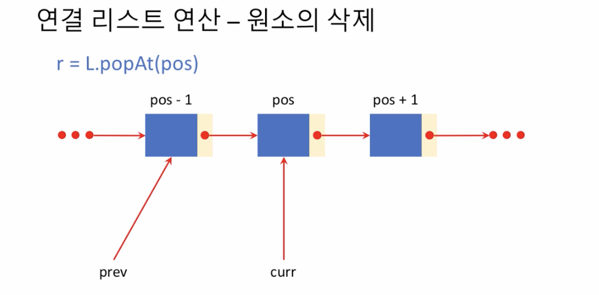
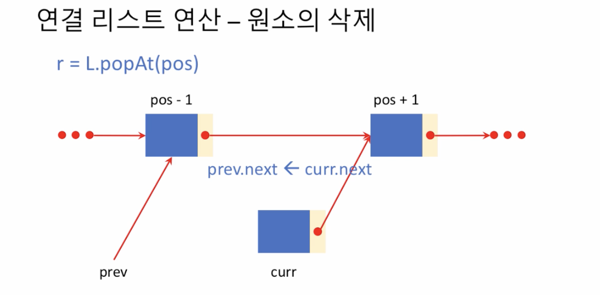
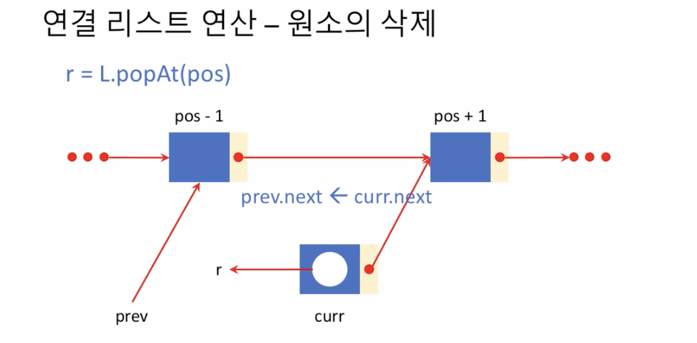
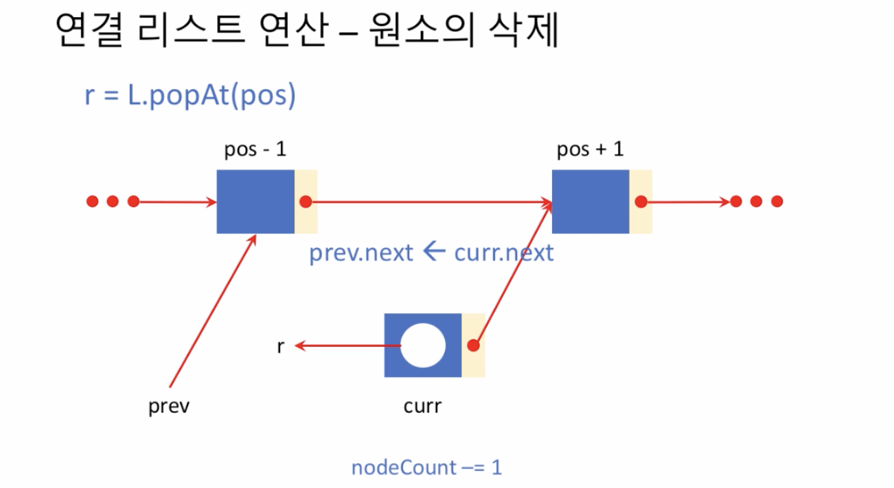
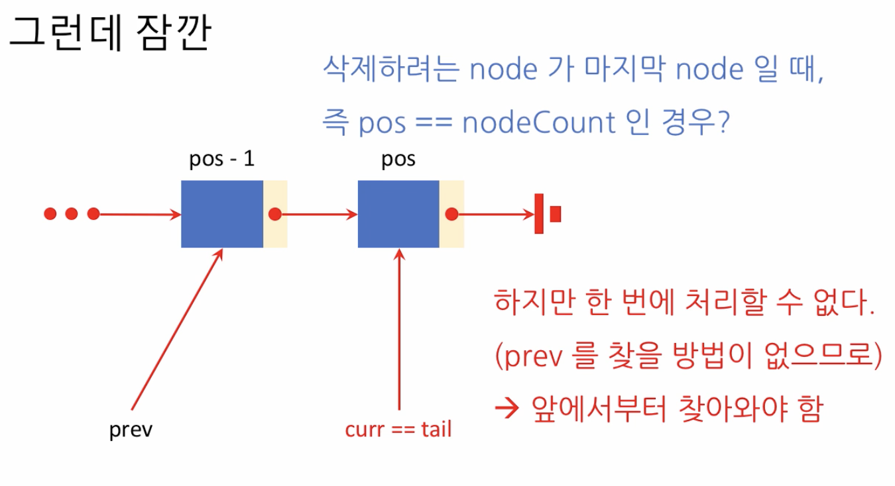

# 4. 원소 삭제

## 원소 삭제

### 1. pos 를 삭제하려면 pos - 1 을 먼저 찾아야 한다 prev 가 가리키게한다.

### 2. 뽑아야 할 노드를 curr 이 가리키도록

### 3. prev.next 가 curr.next 를 가리키도록 한다

### 4. 데이터를 꺼내서 리턴한다

### 5. 노드가 하나 없어졌으므로 하나 줄인다

## 주의사항

* 유일한 노드를 삭제할 때 위의 코드가 오류가 있음을 알 수 있다.

