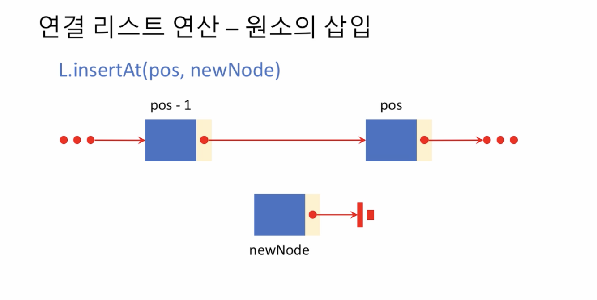
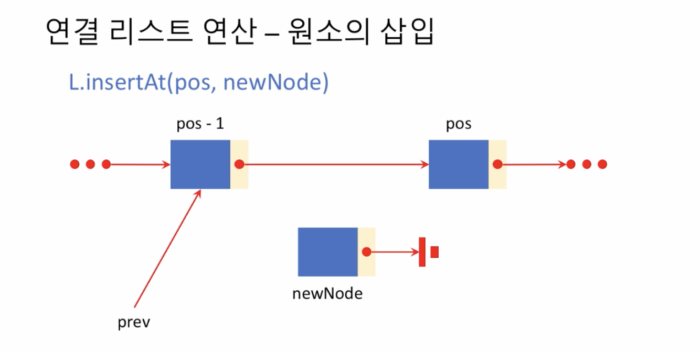
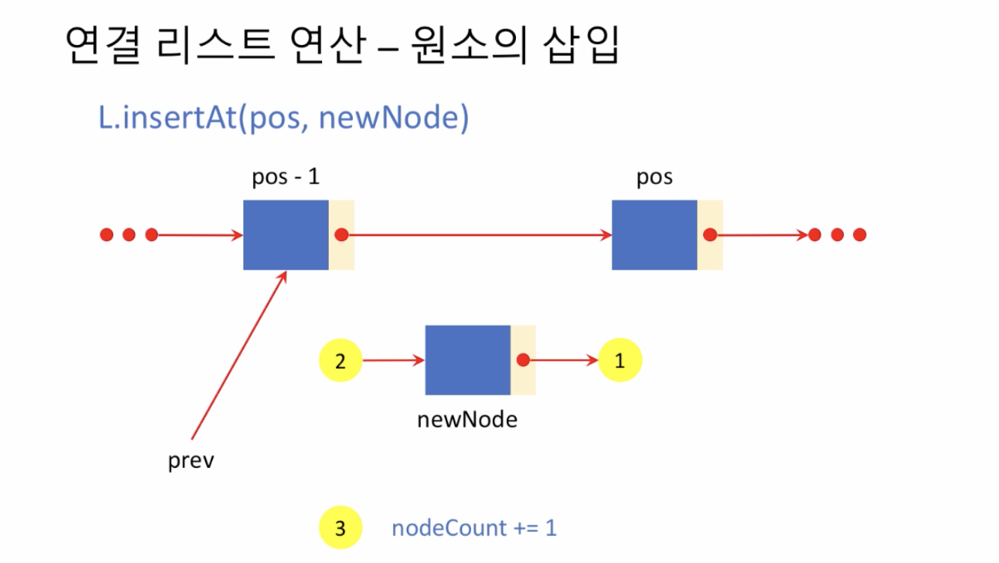
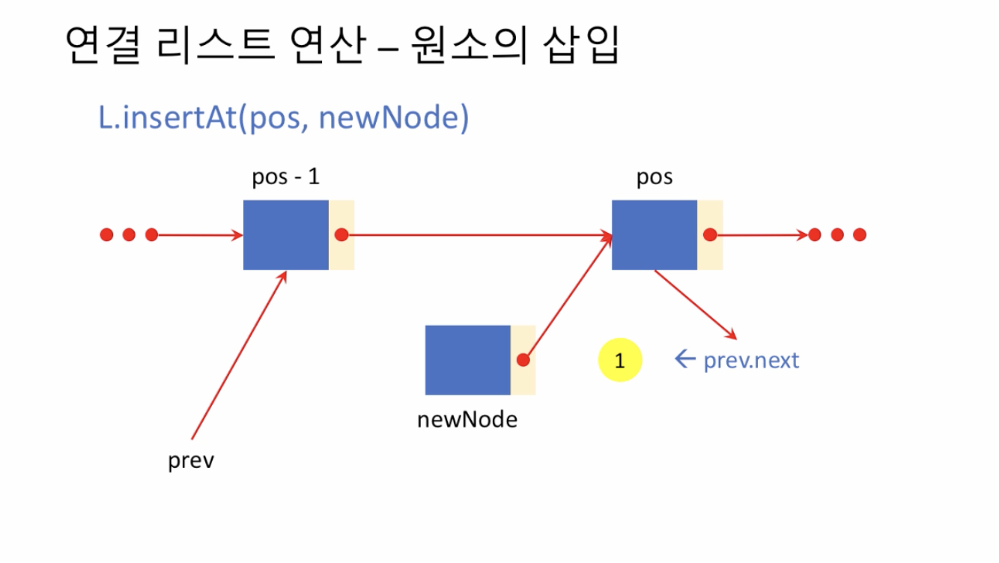
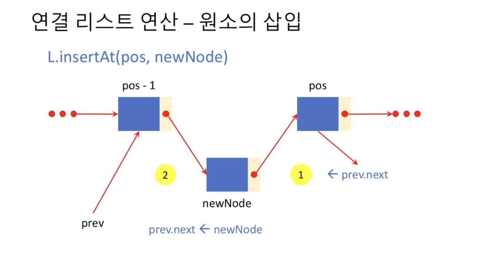
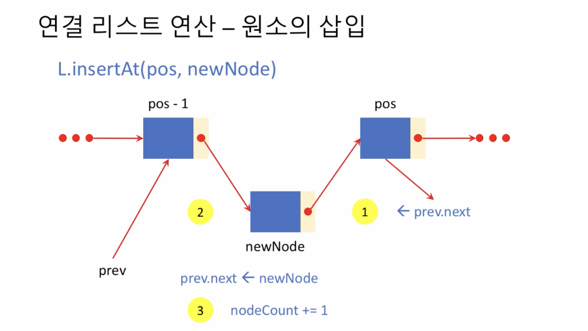

# 1. 원소 삽입

## 원소 삽입

* pos - 1 과 pos 사이에 newNode 를 삽입하고 싶다.

* 우선 삽입하려는 newNode 이전의 노드를 찾아내 prev 로 저장한다

* 1. newNode 의 뒤쪽 링크를 조정하고 
  2. pos - 1 노드가 newNode를 가리키도록하고
  3. node 가 추가되었으므로 nodeCount 를 1 증가시킨다.

### 1. newNode 의 next 위치를 prev.next 로 조정해준다

### 2. newNode 의 이전 위치를 prev.next = newNode 로 조정

### 3. 마지막으로 nodeCount 를 1 증가시킨다

